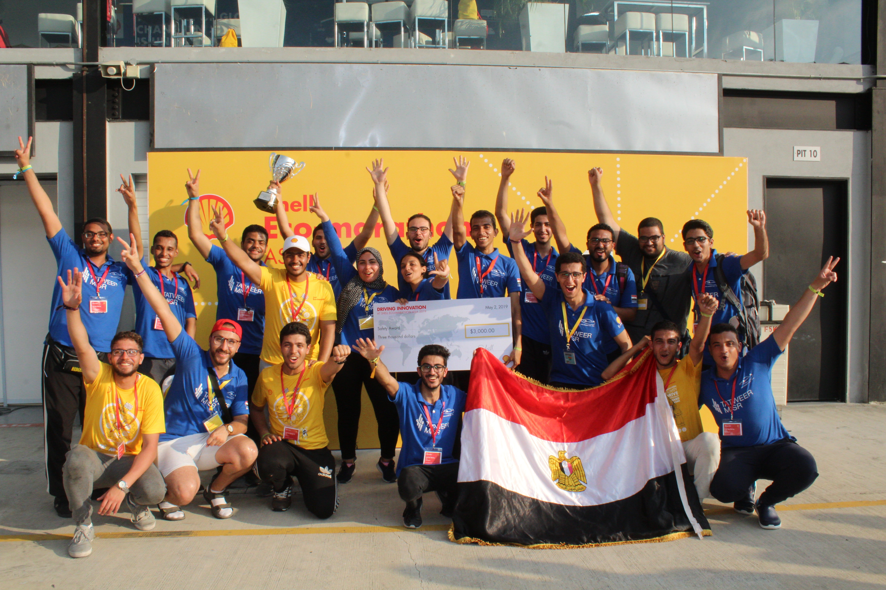

# WE ARE THE WINNERS 🔥

**Cairo University - Shell Eco-marathon** is the 2019 <abbr title="Aims to highlight the importance of road and behavioural safety">Saftey Award</abbr> Winner 🏆

We are **#1** among 103 participating teams over Asia, Africa and Australia in terms of the safety standards of our team.

We have been selected for this award as a result for having the **safest** working environment and implementing the **5S** system in our workshops and paddocks during the competition.

**WE DID IT** 💪

